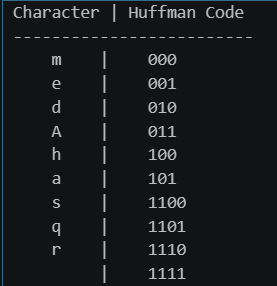

# Huffman-Coding
## Aim
To implement Huffman coding to compress the data using Python.

## Software Required
1. Anaconda - Python 3.7

## Algorithm:
### Step1:
Get the input String

### Step2:
Calculate frequency of each character in the input string

### Step3:
Create tree nodes

### Step4:
Write the Main function to implement Huffman coding

### Step5:
Generate Huffman codes

### Step6:
Print the characters and their Huffman codes
 
## Program:

### Developed By: Ashqar Ahamed S.T
### Register No: 212224240018

``` Python
# Get the input String
string = "Ashqar Ahamed"

```

```py
# Create tree nodes
nodes = [[char, freq] for char, freq in frequency.items()]
    
```
```py
# Calculate frequency of each character in the input string
frequency = {}
for char in string:
    if char in frequency:
        frequency[char] += 1
    else:
        frequency[char] = 1
    
frequency
```
```py
#Main function to implement Huffman coding
while len(nodes) > 1:
    # Sort nodes based on frequency
    nodes = sorted(nodes, key=lambda x: x[1])

    # Pick two smallest nodes
    left = nodes.pop(0)
    right = nodes.pop(0)

    # Create a new node with combined frequency
    new_node = [[left, right], left[1] + right[1]]
    nodes.append(new_node)

# The final node is the Huffman tree
huffman_tree = nodes[0]
```

```py
# Step 5: Generate Huffman codes
huffman_codes = {}

def generate_codes(tree, code=""):
    if isinstance(tree[0], str):  # If it's a leaf node
        huffman_codes[tree[0]] = code
    else:  # If it's an internal node, recurse
        generate_codes(tree[0][0], code + "0")
        generate_codes(tree[0][1], code + "1")

generate_codes(huffman_tree)
```

```py
# Print the characters and its huffmancode
# Step 6: Print the characters and their Huffman codes
print("Character | Huffman Code")
print("-------------------------")
for char, code in huffman_codes.items():
    print(f"    {char}    |    {code}")
```

## Output:

### Print the characters and its huffmancode
<br>




## Result
Thus the huffman coding was implemented to compress the data using python programming.